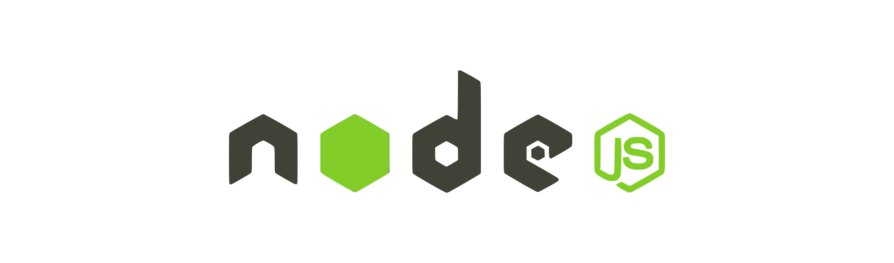

# 🚀 Projeto: Página de Agradecimento


  


## 🌐 Visão Geral

Olá a todos, sejam bem vindos a mais um projeto front end. Já pensou em Netflix com catálogo de livros e não de séries? Isso já virou realidade, e hoje trago um projeto proposto no `Impulso React Web Developer` da DIO, onde recrio a interface do Netflix com uma roupagem nova voltada aos amantes dos livros.

## 📋 Funcionalidades

_A priori_ a projeto está se baseando no [Netflix | Figma ](https://www.figma.com/community/file/1262645606535586462) do designer [Roghith](https://www.figma.com/@roghith002) e as _features_ básicas do Netflix. A ideia central é fazer uma Netflix Bookstore, uma livraria online, mas sem se estender muito.

## 📁 Clonar repositório

Clone este repositório via Bash, usando:

✅ HTTPS:

```bash
git clone https://github.com/SamColt36/netflix-bookstore
```

✅ SSH:

```bash
git clone git@github.com:SamColt36netflix-bookstore
```

✅ GitHub CLI:

```bash
gh repo clone SamColt36/netflix-bookstore
```

✅ Download ZIP.

## 📶 Status

O projeto encontra-se em:

> Finalizado

## 🌐 Acessar o projeto

Acesse a última versão disponível pelo [link](https://netflix-bookstore.vercel.app/)🔗.

## 📂 Estrutura de diretórios

Foi pensada uma estrutura que segue o seguinte diagrama. Os arquivos compilados por padrão vão para o diretório `docs/`.

    -docs/
    ---images/
    -src/
    ---pages/
    ---styles/
    ---scripts/
    -*.config.js
    -README.md
    -LICENSE
    -.gitignore

## 🔧 Instalação

O projeto utiliza o _webpack_ como empacotador de códigos. O _Webpack_ nada mais é do que um empacotador de módulos/códigos. Seu grande diferencial é que ele foi criado para juntar arquivos de JavaScript que são utilizados dentro de um navegador. Sua principal utilidade é para projetos voltados para web focados em módulos de sua aplicação.

Para fazer a instalação das dependências usadas nesse projeto, tais como: _webpack_ e o _tailwindcss_, é necessário ter o NodeJS instalado. Até a data atual, esse último pode ser obtido através do link:

> [Node.js — Download Node.js® (nodejs.org)](https://nodejs.org/en/download)

Para obter as referências das dependências usadas o arquivo _package.json_ pode ser usado, e para mais detalhes use o _package-lock.json_, ambos na raiz do projeto.

_Foi usada a sintaxe do CJS nos quando aos arquivos de configuração._

## 🛠️ Abrir e rodar

Após as devidas instalações e configurações presentes nos arquivos `*.config.js`, caso queira alterar o projeto é necessário recompilar os arquivos para gerar uma nova saída (por _default_ no diretório `docs/`). Pensando nisso, o arquivo _package.json_ conta com dois _scripts_:

```json
"scripts": {
	"build": "webpack --config webpack.config.js",
	"watch": "webpack --watch"
},
```

- **build**: Apenas compila e gera as saídas
- **watch**: Assiste as mudanças no código e compila.

Por fim e não menos importante, rode no terminal um desses dois _scripts_ usando:

```bash
$ npm run build
```

ou

```bash
$ npm run watch
```

## 👥 Contribuições

Contribuições são bem-vindas! Sinta-se à vontade para enviar pull requests ou relatar problemas.

## 📄 Licença

Este projeto está licenciado sob a Licença MIT. Consulte o arquivo LICENSE ou acesse [MIT License (mit-license.org)](https://mit-license.org/) para obter detalhes.
